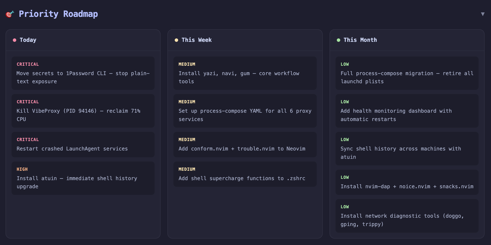
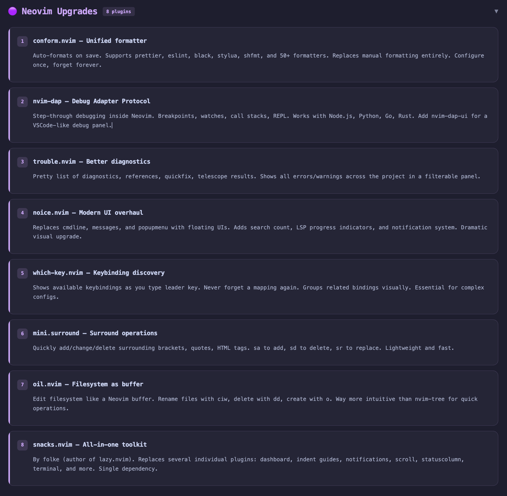
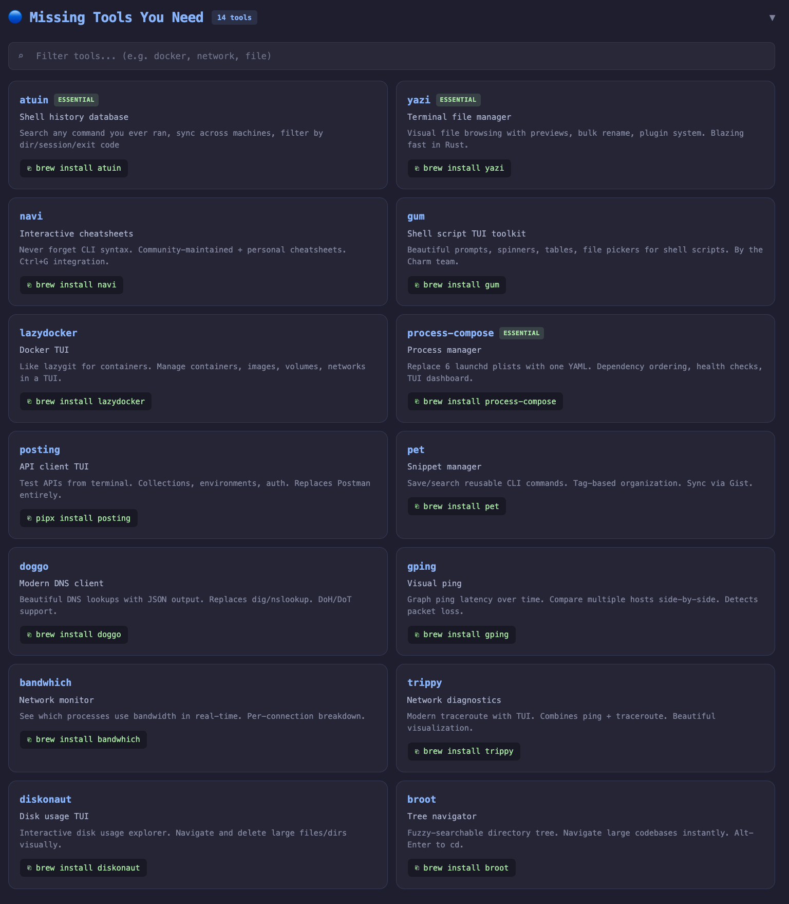
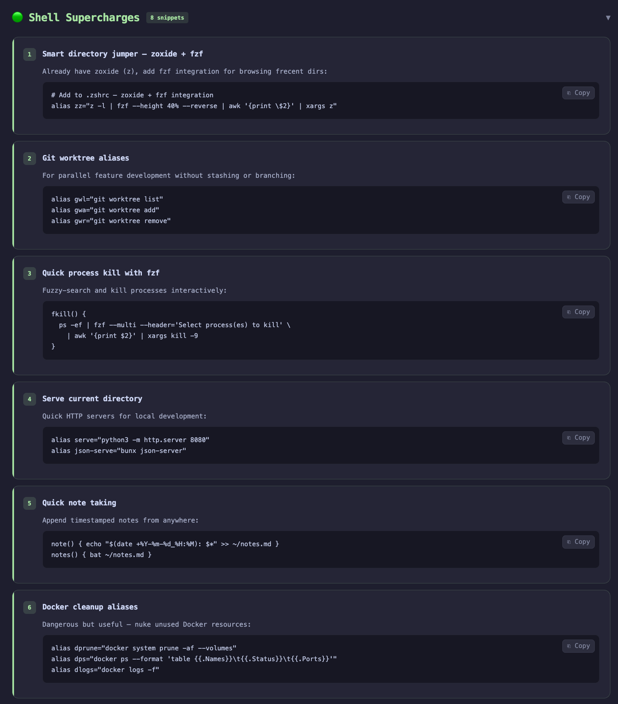
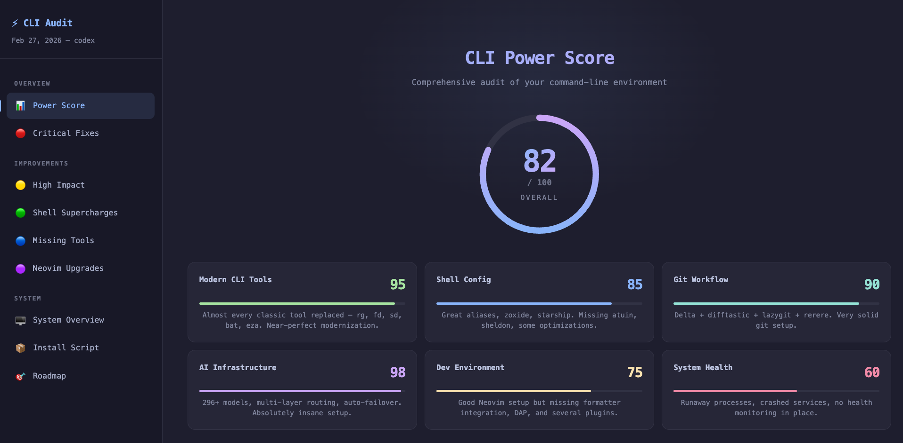

<div align="center">
  

  <h1>🚀 CLI Godmode</h1>
  <p><b>The Ultimate Developer Environment Audit Skill for AI Agents</b></p>
  <p><i>Instantly transform your local terminal into a 100x elite God-Tier setup</i></p>

  <a href="#about">About</a> •
  <a href="#supported-agents">Supported Agents</a> •
  <a href="#installation">Installation</a> •
  <a href="#the-dashboard">The Dashboard</a>
</div>

---

## 🎯 About CLI Godmode

**CLI Godmode** isn't just another script—it's an autonomous Developer Experience (DX) engineer that lives inside your AI coding assistant. It scans, audits, and upgrades your entire terminal setup.

Invoking this skill prompts your AI agent to perform a deep, read-only audit of your machine. It checks your dotfiles, Git configuration, background proxies, CPU hogs, and installed packages, then generates a stunning, offline, interactive HTML dashboard grading your setup and providing exact, copy-pasteable commands to upgrade your workflow.

### Why do you need this?
Modern development is moving incredibly fast. Legacy tools like `cat`, `grep`, and `ls` have been replaced by rust-based alternatives (`bat`, `rg`, `eza`), shell history is now SQLite-backed (`atuin`), and background services are increasingly complex with local LLM proxies.

**CLI Godmode tells you exactly what you're missing to reach the top 1% of developer setups.**

---

## 🤖 Supported Agents

This skill is designed to be **universal** across the modern AI ecosystem. Through the `skills.sh` registry and standard markdown formatting, it is natively compatible with **18+ coding agents**, including:

- **Claude Code** (Anthropic)
- **Cursor**
- **Windsurf** (Codeium)
- **AMP** (ampcode.com)
- **Antigravity** (antigravity.google)
- **Pi** (pi-coding-agent)
- **Cline / Roo / Trae**
- **GitHub Copilot**
- **Goose** (Block)
- **OpenCode** (opencode.ai)
- **Droid** (Factory.ai)
- **Kiro CLI**

---

## 📸 The Godmode Dashboard

The skill generates a beautiful, zero-dependency, Catppuccin-themed HTML dashboard directly on your machine. Here is exactly what it analyzes and presents:

### 1. The Godmode Score & System Audit
The agent computes a holistic score out of 100 based on your adoption of modern CLI tools, your Git workflow, and your system's overall health. This gives you an instant read on your environment's power level.


### 2. Critical Fixes & Security Scans
Before recommending tools, the agent acts like a sysadmin. It catches runaway processes (e.g., extensions or node servers burning 100% CPU), identifies crashed background services, and scans your dotfiles to flag plaintext API keys that need encryption.


### 3. High Impact Improvements & Supercharges
The agent analyzes your specific stack and provides highly tailored, copy-pasteable supercharges. If you use Docker, it provides elite Docker cleanup aliases. If you use `zoxide`, it provides an `fzf` integration script.


### 4. The God-Tier Arsenal
A curated, personalized masonry grid of tools you are *missing*, generated based on your current installations. It won't recommend what you already have—it focuses entirely on the delta between your setup and the "God-Tier Benchmark" (e.g., recommending `atuin`, `yazi`, or `process-compose`).


### 5. Infrastructure Mapping
Particularly vital for developers running local AI agents or LLM routing: the dashboard automatically maps your local listening ports and background proxy services, showing you exactly what is running on your machine.


---

## ⚡ Installation (Universal)

### Option A: Using `skills.sh` / `npx skills` (Recommended)
If your agent supports the global skills.sh registry (Claude Code, AMP, Antigravity, Cursor, Windsurf, etc.), you can add it directly with one command:
```bash
npx skills add codexstar69/cli-godmode
```

### Option B: Pi CLI
If using the Pi agent framework:
```bash
pi add skill cli-godmode --repo https://github.com/codexstar69/cli-godmode
```

### Option C: Claude Code (Manual)
Clone the repository directly into your Claude skills directory:
```bash
git clone https://github.com/codexstar69/cli-godmode.git ~/.claude/skills/cli-godmode
```
*If using the Anthropic allowlist, you can also run:*
```bash
claude -p /path/to/cli-godmode
```

### Option D: Cursor / Windsurf / Aider (Manual)
Simply copy the contents of `SKILL.md` into your project's `.cursorrules`, global agent instructions, or prompt your agent directly:
*"Read the CLI Godmode instructions from `https://raw.githubusercontent.com/codexstar69/cli-godmode/main/SKILL.md` and execute the audit."*

---

## 🎮 How to Trigger It

Once installed, simply invoke the skill in your chat prompt:

```text
> /cli-godmode
```

Or use natural language with your agent:
- *"Audit my terminal setup"*
- *"Activate CLI godmode"*
- *"Find out why my fans are spinning and speed up my workflow"*

The agent will silently scan your system, crunch the data, generate `~/cli-godmode-dashboard.html`, and pop it open in your default browser.

---

## 🔒 Security & Privacy

**CLI Godmode is 100% Read-Only during the scan phase.**
- It reads dotfiles to understand your aliases and tools.
- It runs standard system commands (`ps`, `lsof`, `brew list`) to check health.
- It writes exactly **one** file (`~/cli-godmode-dashboard.html`) to present the results.
- **Zero API keys or secrets are ever exposed** in the generated dashboard or sent to external servers; the script merely flags the file path if it detects plaintext secrets.

---
<p align="center"><i>Built with ❤️ for devs who want to move at the speed of thought.</i></p>